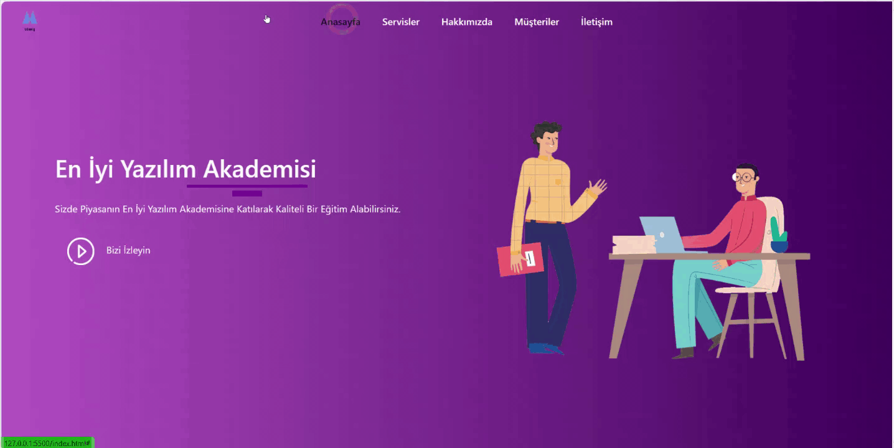

# Udemig-Akademi

Bu proje Bootstrap kullanılarak geliştirilmiş bir eğitim sitesidir.

# Özellikler

- **Gelişmiş Arayüz:** Bootstrap'in sağladığı özelliklerle oluşturulmuş modern ve kullanıcı dostu bir arayüz.
- **Tam Duyarlı:** Farklı cihazlarda (bilgisayar, tablet, mobil) sorunsuz şekilde çalışan, tamamen duyarlı bir tasarım.
- **Kullanım Kolaylığı:** Kullanıcı dostu arayüzü sayesinde sitede kolayca gezinmek ve siteyi kullanmak mümkündür.
- **Eğitici İçerik:** Zengin eğitici içerik ve kaynaklarla kullanıcıların ihtiyaçlarını karşılayacak geniş bir içerik yelpazesi.

# Ekran Kaydı:
